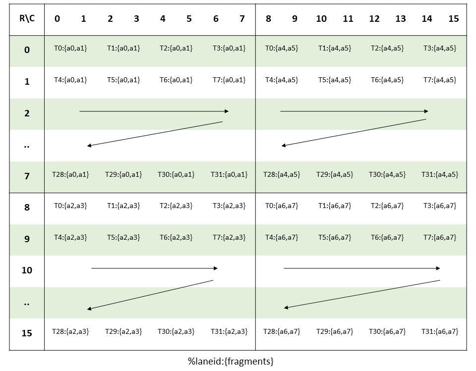
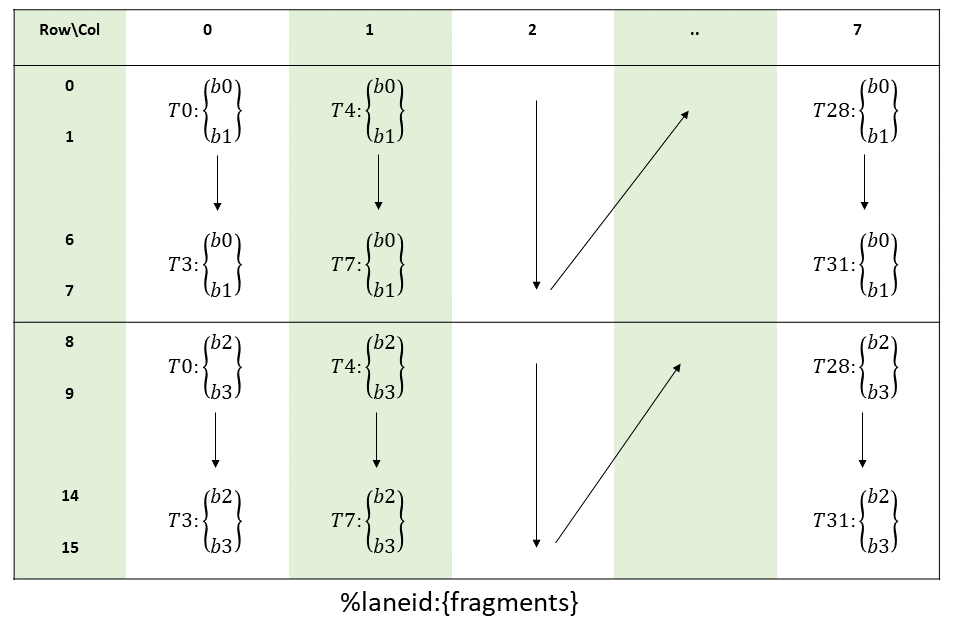
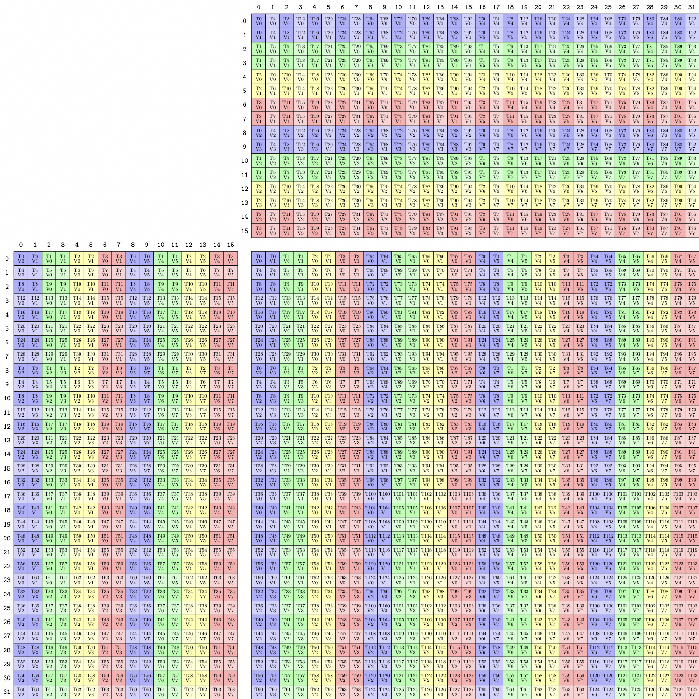
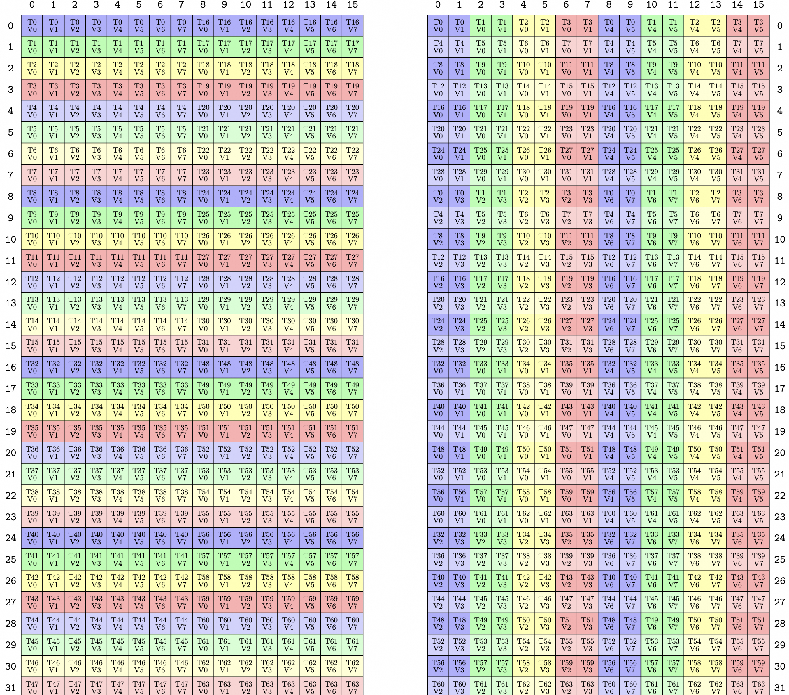

# CuTe Detail

## CuTe MMA

### MMA Operation

MMA Operation 位置在 `cute/arch/mma_sm*` 文件中，是 PTX 指令的封装。
类的名称里指定了 SM 计算能力，MNK 的形状，`D = A x B + C` 的数据类型，和 AB 矩阵是否转置。
N (normal) 表示 Col-major，T (transpose) 表示 Row-major。
`fma` 接口中调用 PTX 指令运算 `D = A x B + C`。

```cpp
// MMA 16x8x8 TN
struct SM80_16x8x8_F32F16F16F32_TN
{
  using DRegisters = float[4];
  using ARegisters = uint32_t[2];
  using BRegisters = uint32_t[1];
  using CRegisters = float[4];

  CUTE_HOST_DEVICE static void
  fma(float         & d0, float         & d1, float         & d2, float         & d3,
      uint32_t const& a0, uint32_t const& a1,
      uint32_t const& b0,
      float const   & c0, float const   & c1, float const   & c2, float const   & c3)
  {
#if defined(CUTE_ARCH_MMA_SM80_ENABLED)
    asm volatile(
      "mma.sync.aligned.m16n8k8.row.col.f32.f16.f16.f32 "
      "{%0,  %1,  %2,  %3},"
      "{%4,  %5},"
      "{%6},"
      "{%7,  %8,  %9,  %10};\n"
      : "=f"(d0), "=f"(d1), "=f"(d2), "=f"(d3)
      :  "r"(a0),  "r"(a1),
         "r"(b0),
         "f"(c0),  "f"(c1),  "f"(c2),  "f"(c3));
#else
    CUTE_INVALID_CONTROL_PATH("Attempting to use SM80_16x8x8_F32F16F16F32_TN without CUTE_ARCH_MMA_SM80_ENABLED");
#endif
  }
};
```

对于 SM90 wgmma，AB 矩阵的转置情况变为在模版参数中传入。
类的名称中增加了 AB 矩阵是在寄存器 (R) 或 SMEM (S) 的标识。
可以注意到仅有 RS 和 SS 两种情况。
如果 A 矩阵在寄存器中，则只能是 K-major 排布 (Row-major)。

```cpp
// GMMA 64x8x16 F32+=F16*F16
template <
  GMMA::Major tnspA,
  GMMA::Major tnspB,
  GMMA::ScaleIn  scaleA = GMMA::ScaleIn::One,
  GMMA::ScaleIn  scaleB = GMMA::ScaleIn::One
>
struct MMA_64x8x16_F32F16F16_RS
{
  using DRegisters = void;
  using ARegisters = uint32_t[4];
  using BRegisters = uint64_t[1];
  using CRegisters = float[4];

  static_assert(tnspA == GMMA::Major::K,
      "Register source operand A must have K major layout.");

  CUTE_HOST_DEVICE static void
  fma(uint32_t const& a0, uint32_t const& a1, uint32_t const& a2, uint32_t const& a3,
      uint64_t const& desc_b,
      float         & d0, float         & d1, float         & d2, float         & d3,
      GMMA::ScaleOut const scale_D = GMMA::ScaleOut::One)
  {
#if defined(CUTE_ARCH_MMA_SM90A_ENABLED)
    cutlass::arch::synclog_emit_wgmma_reg_smem(__LINE__, desc_b);
    asm volatile(
    "{\n"
      ".reg .pred p;\n"
      "setp.ne.b32 p, %9, 0;\n"
      "wgmma.mma_async.sync.aligned.m64n8k16.f32.f16.f16 "
      "{%0,  %1,  %2,  %3},"
      "{%4,  %5,  %6,  %7},"
      " %8,"
      " p,   %10, %11, %12;\n"
    "}\n"
      : "+f"(d0), "+f"(d1), "+f"(d2), "+f"(d3)
      :  "r"(a0),  "r"(a1),  "r"(a2),  "r"(a3),
         "l"(desc_b),
         "r"(int32_t(scale_D)), "n"(int32_t(scaleA)), "n"(int32_t(scaleB)), "n"(int32_t(tnspB)));
#else
    CUTE_INVALID_CONTROL_PATH("Attempting to use MMA_64x8x16_F32F16F16_RS without CUTE_ARCH_MMA_SM90A_ENABLED");
#endif
  }
};
```

### MMA Traits

MMA Traits 中提供每种 MMA Operation 的基本信息：

```cpp
using ElementDVal =  // Logical D-value type
using ElementAVal =  // Logical A-value type
using ElementBVal =  // Logical B-value type
using ElementCVal =  // Logical C-value type

using Shape_MNK =    // Logical MxNxK shape of the MMA

using ThrID     =    // Logical thread id (tid) -> tidx

using ALayout =      // (Logical thread id (tid), Logical value id (vid)) -> Flat MK-coord
using BLayout =      // (Logical thread id (tid), Logical value id (vid)) -> Flat NK-coord
using CLayout =      // (Logical thread id (tid), Logical value id (vid)) -> Flat MN-coord
```

ThrID 表示了需要参与 MMA 指令的线程的 Layout。
例如，在 SM70 上，有 `ThrID = (_4, _2):(_1, _16)`，即 8 个线程发起一个 MMA 指令。
而在 SM90 WGMMA 上，有 `ThrID = (_128):(_1)`，即一个 warp group 128 个线程发起一个 WGMMA 指令。
ABC 的 Layout 是一个映射 `(T, V) -> Idx`，将第 T 个逻辑线程中的第 V 个值的逻辑坐标映射至按 Col-major 排布展平的物理坐标。

```cpp
// (T32,V2) -> (M8,N8)
using SM80_8x8_Row  = Layout<Shape <Shape < _4,_8>,_2>,
                             Stride<Stride<_16,_1>,_8>>;
// (T32,V4) -> (M16,N8)
using SM80_16x8_Row = Layout<Shape <Shape < _4,_8>,Shape < _2,_2>>,
                             Stride<Stride<_32,_1>,Stride<_16,_8>>>;
template <>
struct MMA_Traits<SM80_16x8x8_F16F16F16F16_TN>
{
  using ValTypeD = half_t;
  using ValTypeA = half_t;
  using ValTypeB = half_t;
  using ValTypeC = half_t;

  using Shape_MNK = Shape<_16,_8,_8>;
  using ThrID   = Layout<_32>;
  using ALayout = SM80_16x8_Row;
  using BLayout = SM80_8x8_Row;
  using CLayout = SM80_16x8_Row;
};
```

### MMA Atom

MMA Atom 继承 MMA Traits，作为一条 MMA 指令的最终封装。

```cpp
template <class MMAOperation, class... Args>
struct MMA_Atom<MMA_Traits<MMAOperation, Args...>>
  : MMA_Traits<MMAOperation, Args...>
{
  using MMA_Op = MMAOperation;
  using Traits = MMA_Traits<MMAOperation, Args...>;

  // Element value types from the MMA_Traits
  using ValTypeD = typename Traits::ValTypeD;
  using ValTypeA = typename Traits::ValTypeA;
  using ValTypeB = typename Traits::ValTypeB;
  using ValTypeC = typename Traits::ValTypeC;

  // Thr-Val layouts from the MMA_Traits
  using Shape_MNK  = typename Traits::Shape_MNK;
  using ThrID      = typename Traits::ThrID;
  using LayoutC_TV = typename Traits::CLayout;
  using LayoutA_TV = typename Traits::ALayout;
  using LayoutB_TV = typename Traits::BLayout;

  // Fragment value types from the MMA_Traits (optional, defaults to Val type)
  using FrgTypeD = typename detail::FrgTypeC_or_Default<Traits>::type;
  using FrgTypeA = typename detail::FrgTypeA_or_Default<Traits>::type;
  using FrgTypeB = typename detail::FrgTypeB_or_Default<Traits>::type;
  using FrgTypeC = typename detail::FrgTypeC_or_Default<Traits>::type;
...
```

### TiledMMA

TiledMMA 将多个 MMA Atom 组合起来，表达使用多个 MMA 指令来计算更大的一块 GEMM。

```cpp
// @tparam MMA_Atom The MMA_Atom to use in the TiledMMA
// @tparam AtomLayoutMNK The MNK-tiling of the Atom to be performed.
// @tparam PermuationsMNK Permutations to apply to each MNK-mode before tiling for the Atom.
template <class MMA_Atom,
          class AtomLayoutMNK,
          class PermutationMNK = Tile<Underscore,Underscore,Underscore>>
struct TiledMMA : MMA_Atom
{
  using Atom           = MMA_Atom;
  using AtomShape_MNK  = typename MMA_Atom::Shape_MNK;
  using AtomThrID      = typename MMA_Atom::ThrID;
  using AtomLayoutC_TV = typename MMA_Atom::LayoutC_TV;
  using AtomLayoutA_TV = typename MMA_Atom::LayoutA_TV;
  using AtomLayoutB_TV = typename MMA_Atom::LayoutB_TV;
...
```

只传入 MMA Atom 模板参数时，默认 AtomLayoutMNK 是 `(_1, _1, _1)`，即只有一个 MMA Atom。

```cpp
MMA_Atom mma = MMA_Atom<SM70_8x8x4_F32F16F16F32_NT>{};
```

等价于 MNK 大小为 `(_8, _8, _4)` 的一个 MMA 指令：

```cpp
TiledMMA mma = make_tiled_mma(SM70_8x8x4_F32F16F16F32_NT{},
                              Layout<Shape<_1,_1,_1>>{},   // Layout of Atoms
                              Tile<_8,_8,_4>{});           // Tiler
```

也可以将多个 MMA Atom 组成一个更大的 Tiled MMA。
用四个 8 线程 8x8x4 的 MMA Atom 组成一个 32 线程 16x16x4 的 Tiled Atom：

```cpp
TiledMMA mma = make_tiled_mma(SM70_8x8x4_F32F16F16F32_NT{},
                              Layout<Shape <_2,_2>,
                                      Stride<_2,_1>>{});   // 2x2 n-major layout of Atoms
print_latex(mma);
```

同样使用 32 线程，还可以进一步扩张到 32x32x4 的 Tiled Atom：

```cpp
TiledMMA mma = make_tiled_mma(SM70_8x8x4_F32F16F16F32_NT{},
                              Layout<Shape <_2,_2>,
                                      Stride<_2,_1>>{},  // 2x2 n-major layout of Atoms
                              Tile<_32,_32,_4>{});      // 32x32x4 tiler
print_latex(mma);
```

make_tiled_mma 的第二个参数表示参与 MMA Atom 线程/线程块的 Layout。
第三个参数 PermuteMNK 表示整个 MMA 的大小和排布，这里 32x32 的 C 矩阵中，每个 16x16 的块都是上面的 16x16 Tiled MMA 的排布。
但是，这会导致 AB 矩阵的读取不是连续排布的。
M 维度上，第 0 个 MMA Atom 处理 M 维度上的第 0、2 个 8x8x4 的 MMA。
我们会希望这个 MMA Atom 连续处理 M 维度上的第 0、1 个 8x8x4 的 MMA。
因此，第三个参数 PermuteMNK 在 M 维度上进行了变化：

```cpp
TiledMMA mma = make_tiled_mma(SM70_8x8x4_F32F16F16F32_NT{},
                              Layout<Shape <_2,_2>,
                                      Stride<_2,_1>>{},       // 2x2 n-major layout of Atoms
                              Tile<Layout<Shape <_4,_4,_2>,
                                          Stride<_1,_8,_4>>, // Permutation on M, size 32
                                    _32,                      // Permutation on N, size 32 identity
                                    _4>{});                   // Permutation on K, size 4 identity
print_latex(mma);
```

## CuTe GEMM Example

### MMA

使用 `SM80_16x8x16_F32BF16BF16F32_TN`，对应 `mma.sync.aligned.m16n8k16.row.col.f32.f16.f16.f32`。
A 矩阵的 layout 如下图：



B 矩阵的 layout：



A 用 TV layout 表示为 `((4, 8), (2, 2, 2)) : ((32, 1), (16, 8, 16))`，
B 用 TV layout 表示为 `((4, 8), (2, 2) : (16, 1), (8, 64))`。
这里的 layout 需要转置才能得到，为什么？
这里 stride 为 1 恰恰不为连续，反而是跨过了一个最低的维度。

我们使用 4 个 warp，组成一个 32x32x16 的 TiledMMA，这时每个 warp 发起两个 mma 指令：



构造一个 5120x5120x4096 的 GEMM，A 和 B 都是 K-major，SMEM 的 Tile shape 为 128x128x16。
在一个 tiled_mma 内，MMA 在 N 维度上需要循环重复 2 次。
在一个 block tile 内，tiled_mma 要在 M 维度上重复 4 次，在 N 维度上重复 4 次。
打印 tiled_mma 一个线程在 GMEM 上的划分 Layout：

```
tCgA: gmem_ptr[16b](0x7bb46e000000) o ((_2,_2,_2),_4,_1,256):((_1,32768,_8),131072,_0,_16)
tCgB: gmem_ptr[16b](0x7bb468000000) o ((_2,_2),(_2,_4),_1,256):((_1,_8),(65536,131072),_0,_16)
tCgC: gmem_ptr[32b](0x7bb428000000) o ((_2,_2),_4,_8):((_1,40960),163840,_16)
```

tCgA 的 MMA 维度有 8 个元素，在 M 维度上重复 4 次。
tCgB 的 MMA 维度有 4 个元素，在 M 维度上重复 8 次。
tCgC 的 MMA 维度有 4 个元素，在 M 维度上重复 4 次，在 N 维度上重复 8 次。
符合预期。

### S2R Copy

使用 `SM75_U32x4_LDSM_N` 这个 CopyAtom，对应 `ldmatrix.sync.aligned.x4.m8n8.shared.b16`。
这样一个指令拷贝大小 32x8 的矩阵，每个线程拿到 8 个元素。
但实际上，我们看作是拷贝了一块大小为 16x16 的矩阵，让 k 方向与 mma 的 k 大小对齐。
这样，对于左半 16x8 的矩阵，我们让线程 0-15 读取。对于右半 16x8 的矩阵，让线程 16-31 读取。 

对于 A，一次拷贝正好满足一次 MMA 所需的元素。
对于 B，一次拷贝能满足两次 MMA 所需的元素，恰好等于做一次 tiled_mma。



可以发现，这时存在 bank conflict：
每行 16 个元素即 32 bytes，则每 4 行间隔 128 bytes。
线程 0 和线程 4 存在 bank conflict

一个 tiled_copy 包含 2 个 warp，拷贝大小为 32x16 的矩阵，符合一次 tiled_mma 的大小。

打印 s2r copy 一个线程在 SMEM 和 RMEM 上的划分 Layout：

```
tXsA: ptr[16b](0x7bb500000400) o ((_8,_1),_4,_1,_2):((_1,_0),_512,_0,_2048)
tXrA: ptr[16b](0x7bb4adfffba0) o ((_8,_1),_4,_1):((_1,_0),_8,_0)
tXsB: ptr[16b](0x7bb500002400) o ((_8,_1),_4,_1,_2):((_1,_0),_512,_0,_2048)
tXrB: ptr[16b](0x7bb4adfffbe0) o ((_8,_1),_4,_1):((_1,_0),_8,_0)
```

A 和 B 在 Copy 维度上都有 8 个元素，对应一次 tiled_mma。
A 在 M 维度上重复 4 次，B 在 N 维度上重复 4 次，对应了整个 tile block 上的 mma。

---

---

bf16 on sm120
5120 x 5120 x 4096

### 1

bM, bN, bK = 128, 128, 16
g2s: cp.async
s2r: ldmatrix.x4
single-stage

GEMM average time over 10 iterations: 1.7016 ms
GEMM average throughput over 10 iterations: 100965.9084 GFLOPS

```
TiledMma: TiledMMA
  ThrLayoutVMNK:  (_32,_2,_4,_1):(_1,_32,_64,_0)
  PermutationMNK: (_128,_128,_16)
MMA_Atom
  ThrID:      _32:_1
  Shape_MNK:  (_16,_8,_16)
  LayoutA_TV: ((_4,_8),(_2,_2,_2)):((_32,_1),(_16,_8,_128))
  LayoutB_TV: ((_4,_8),(_2,_2)):((_16,_1),(_8,_64))
  LayoutC_TV: ((_4,_8),(_2,_2)):((_32,_1),(_16,_8))

copyA: TiledCopy
  Tiler_MN:       (_128,_16)
  TiledLayout_TV: ((_2,_128),_8):((_1024,_1),_128)
Copy_Atom
  ThrID:        _1:_0
  ValLayoutSrc: (_1,_8):(_0,_1)
  ValLayoutDst: (_1,_8):(_0,_1)
  ValLayoutRef: (_1,_8):(_0,_1)
  ValueType:    16b

copyB: TiledCopy
  Tiler_MN:       (_128,_16)
  TiledLayout_TV: ((_2,_128),_8):((_1024,_1),_128)
Copy_Atom
  ThrID:        _1:_0
  ValLayoutSrc: (_1,_8):(_0,_1)
  ValLayoutDst: (_1,_8):(_0,_1)
  ValLayoutRef: (_1,_8):(_0,_1)
  ValueType:    16b

s2r_atom_A: Copy_Atom
  ThrID:        _32:_1
  ValLayoutSrc: (_32,_8):(_8,_1)
  ValLayoutDst: (_32,(_2,_4)):(_2,(_1,_64))
  ValLayoutRef: (_32,(_2,_4)):(_2,(_1,_64))
  ValueType:    16b

s2r_atom_B: Copy_Atom
  ThrID:        _32:_1
  ValLayoutSrc: (_32,_8):(_8,_1)
  ValLayoutDst: (_32,(_2,_4)):(_2,(_1,_64))
  ValLayoutRef: (_32,(_2,_4)):(_2,(_1,_64))
  ValueType:    16b

gA: gmem_ptr[16b](0x7a3346000000) o (_128,_16,256):(4096,_1,_16)
gB: gmem_ptr[16b](0x7a3340000000) o (_128,_16,256):(4096,_1,_16)
gC: gmem_ptr[32b](0x7a3300000000) o (_128,_128):(5120,_1)
sA: ptr[16b](0x7a3400000400) o (_128,_16):(_16,_1)
tAgA: gmem_ptr[16b](0x7a3346000000) o ((_8,_1),_1,_1,256):((_1,_0),_0,_0,_16)
tAsA: ptr[16b](0x7a3400000400) o ((_8,_1),_1,_1):((_1,_0),_0,_0)

sB: ptr[16b](0x7a3400001400) o (_128,_16):(_16,_1)
tAgB: gmem_ptr[16b](0x7a3340000000) o ((_8,_1),_1,_1,256):((_1,_0),_0,_0,_16)
tAsB: ptr[16b](0x7a3400001400) o ((_8,_1),_1,_1):((_1,_0),_0,_0)

tXsA: ptr[16b](0x7a3400000400) o ((_8,_4),_1,_1):((_1,_512),_0,_0)
tXrA: ptr[16b](0x7a3385fffbd0) o ((_8,_4),_1,_1):((_1,_8),_0,_0)
tXsB: ptr[16b](0x7a3400001400) o ((_8,_2),_1,_1):((_1,_1024),_0,_0)
tXrB: ptr[16b](0x7a3385fffc10) o ((_8,_2),_1,_1):((_1,_8),_0,_0)
```

### 2

bM, bN, bK = 128, 128, 16
g2s: cp.async
s2r: ldmatrix.x4
2-stages g2s

GEMM average time over 10 iterations: 1.5358 ms
GEMM average throughput over 10 iterations: 111859.7718 GFLOPS

### SW

```
TiledMma: TiledMMA
  ThrLayoutVMNK:  (_32,_2,_4,_1):(_1,_32,_64,_0)
  PermutationMNK: (_64,_64,_16)
MMA_Atom
  ThrID:      _32:_1
  Shape_MNK:  (_16,_8,_16)
  LayoutA_TV: ((_4,_8),(_2,_2,_2)):((_32,_1),(_16,_8,_128))
  LayoutB_TV: ((_4,_8),(_2,_2)):((_16,_1),(_8,_64))
  LayoutC_TV: ((_4,_8),(_2,_2)):((_32,_1),(_16,_8))

copyA: TiledCopy
  Tiler_MN:       (_32,_64)
  TiledLayout_TV: ((_8,_32),_8):((_256,_1),_32)
Copy_Atom
  ThrID:        _1:_0
  ValLayoutSrc: (_1,_8):(_0,_1)
  ValLayoutDst: (_1,_8):(_0,_1)
  ValLayoutRef: (_1,_8):(_0,_1)
  ValueType:    16b

copyB: TiledCopy
  Tiler_MN:       (_32,_64)
  TiledLayout_TV: ((_8,_32),_8):((_256,_1),_32)
Copy_Atom
  ThrID:        _1:_0
  ValLayoutSrc: (_1,_8):(_0,_1)
  ValLayoutDst: (_1,_8):(_0,_1)
  ValLayoutRef: (_1,_8):(_0,_1)
  ValueType:    16b

s2r_atom_A: Copy_Atom
  ThrID:        _32:_1
  ValLayoutSrc: (_32,_8):(_8,_1)
  ValLayoutDst: (_32,(_2,_4)):(_2,(_1,_64))
  ValLayoutRef: (_32,(_2,_4)):(_2,(_1,_64))
  ValueType:    16b

s2r_atom_B: Copy_Atom
  ThrID:        _32:_1
  ValLayoutSrc: (_32,_8):(_8,_1)
  ValLayoutDst: (_32,(_2,_4)):(_2,(_1,_64))
  ValLayoutRef: (_32,(_2,_4)):(_2,(_1,_64))
  ValueType:    16b

gA: gmem_ptr[16b](0x7583d2000000) o (_128,_64,64):(4096,_1,_64)
gB: gmem_ptr[16b](0x7583cc000000) o (_128,_64,64):(4096,_1,_64)
gC: gmem_ptr[32b](0x75838c000000) o (_128,_128):(5120,_1)

sA: ptr[16b](0x758500000400) o Sw<3,3,3> o _0 o ((_8,_16),((_8,_8),_1)):((_8,_512),((_1,_64),_0))
tAgA: gmem_ptr[16b](0x7583d2000000) o ((_8,_1),_4,_1,64):((_1,_0),131072,_0,_64)
tAsA: ptr[16b](0x758500000400) o ((_8,_1),_4,_1):((_1,_0),_2048,_0)
tCsA: ptr[16b](0x758500000400) o ((_2,_2,_2),_4,(_2,_2)):((_1,_512,72),_2048,(144,288))
tCrA: ptr[16b](0x758411fffab0) o ((_2,_2,_2),(_2,_2),_4):((_1,_2,_4),(_32,_64),_8)

sB: ptr[16b](0x758500004400) o Sw<3,3,3> o _0 o ((_8,_16),((_8,_8),_1)):((_8,_512),((_1,_64),_0))
tAgB: gmem_ptr[16b](0x7583cc000000) o ((_8,_1),_4,_1,64):((_1,_0),131072,_0,_64)
tAsB: ptr[16b](0x758500004400) o ((_8,_1),_4,_1):((_1,_0),_2048,_0)
tCsB: ptr[16b](0x758500004400) o ((_2,_2),_4,(_2,_2)):((_1,72),_2048,(144,288))
tCrB: ptr[16b](0x758411fffbb0) o ((_2,_2),(_2,_2),_4):((_1,_2),(_16,_32),_4)

tXsA: ptr[16b](0x758500000400) o ((_8,_2),_2,(_2,_2)):((_1,_2048),_4096,(144,288))
tXrA: ptr[16b](0x758411fffab0) o ((_8,_2),_2,_4):((_1,_32),_64,_8)
tXsB: ptr[16b](0x758500004400) o ((_8,_1),_2,(_2,_2)):((_1,_0),_4096,(144,288))
tXrB: ptr[16b](0x758411fffbb0) o (((_4,_2),_1),_2,_4):(((_1,_16),_0),_32,_4)
```