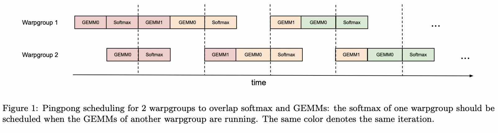
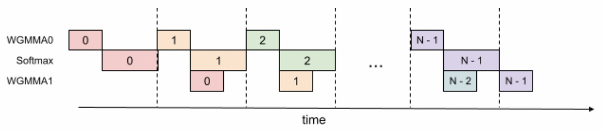

# Flash Attention

## Online Softmax

### 3-Pass Safe Softmax

Softmax 的标准定义是
$$
y_i = \frac{\exp(x_i)}{\sum_j \exp(x_j)}
$$
但是当 $x_i$ 很大时，$\exp(x_i)$ 会溢出。为了避免这种情况，通常会先计算输入的最大值 $m = \max_i (x_i)$，然后使用
$$
y_i = \frac{\exp(x_i - m)}{\sum_j \exp(x_j - m)}
$$
来计算 softmax，确保 $x_i - m \le 0$，从而避免溢出。
朴素的实现这种方法需要遍历三次输入：

1. 计算最大值 $m_i = \max(m_{i-1}, x_i)$。
2. 计算归一化因子 $d_i = d_{i-1} + \exp(x_j - m_N)$。
3. 计算最终的 softmax 输出 $y_i = \exp(x_i - m_N) / d_N$。

### 2-Pass Safe Online Softmax

我们可以把前两次遍历融合成一次，在一次遍历中同时更新最大值和归一化因子，实现 2-Pass Safe Softmax：

1. 计算最大值和归一化因子
    - $m_i = \max(m_{i-1}, x_i)$
    - $d_i = d_{i-1} \cdot \exp(m_{i-1} - m_i) + \exp(x_i - m_i)$
2. 计算最终的 softmax 输出 $y_i = \exp(x_i - m_N) / d_N$。

> 把 3-Pass 优化成 2-Pass 有什么收益吗？从计算量上看，2-Pass 甚至还要比 3-Pass 多一些计算。但从全局内存访问的角度来看，2-Pass 只需要遍历两次输入，而 3-Pass 需要遍历三次，减少了一次内存访问。对于 softmax 这种 memory-bound 的操作来说，减少内存访问往往能带来更大的性能提升。

## FlashAttention V1

### 1-Pass Attention

忽略缩放常数 $\sqrt{d}$，标准 Attention 的计算公式是
$$
O = \text{Softmax}(QK^T)V
$$
其中 $Q, K, V$ 的形状分别是 $(M, D)$，$(N, D)$，$(N, D)$。
那么在 2-Pass Softmax 的基础上，每一行 $O_i$ 的计算可以分解成以下两步：

1. 计算 $QK^T$ 的最大值和归一化因子
    - $x_j = Q_i K_j^T$
    - $m_j = \max(m_{j-1}, x_j)$
    - $d_j = d_j \cdot \exp(m_{j-1} - m_j) + \exp(x_j - m_j)$
2. 计算 $O$
    - $O_j = O_{j-1} + \frac{\exp(x_j - m_D)}{d_N} V_j$

虽然 Softmax 不能被进一步优化成 1-Pass，但是 Attention 只需要得到最终的输出 $O$，而不需要中间的 Softmax 结果。实际上 Attention 是可以被优化成 1-Pass 的。
定义 $O'_j$

$$
O'_j = \sum_{k=1}^{j} \frac{\exp(x_k-m_j)}{d_j} V_k
$$

可以得到递推式：

$$
O'_j = O'_{j-1} \cdot \exp(m_{j-1}-m_j) \cdot \frac{d_{j-1}}{d_j} + \frac{\exp(x_j - m_j)}{d_j} V_j
$$

由此，我们可以在一次遍历中同时计算 $m_j, d_j, O'_j$，从而实现 1-Pass Attention：

1. 计算 $QK^T$ 的最大值、归一化因子和输出
    - $x_j = Q_i K_j^T$
    - $m_j = \max(m_{j-1}, x_j)$
    - $d_j = d_j \cdot \exp(m_{j-1} - m_j) + \exp(x_j - m_j)$
    - $O'_j = O'_{j-1} \cdot \exp(m_{j-1}-m_j) \cdot \frac{d_{j-1}}{d_j} + \frac{\exp(x_j - m_j)}{d_j} V_j$

### Tiling

我们把 K 和 V 分块，每块大小为 $(n, D)$，再把 Q 每块分为 $(m, D)$。
我们先分析对于 $Q_i, K_j, V_j$ 分块的计算过程：

1. 计算 $QK^T$
    - $X = Q_i K_j^T \in \R^{(m,n)}$
2. 对每行求
    - $\tilde{m_i}[k] = \max_l(X_{k,l}) \in \R^m$
    - $P_{k,l} = \exp(X_{k,l} - \tilde{m_i}) \in \R^{(m,n)}$
    - $d_i[k] = \sum_l P_{k,l} \in \R^m$
3. 对每行更新最大值和归一化因子
    - $m_i[k] = \max(m'_i[k], \tilde{m_i}[k])$
    - $d_i[k] = d'_i[k] \cdot \exp(m'_i[k] - m_i[k]) + d_i[k] \cdot \exp(\tilde{m_i}[k] - m_i[k])$
4. 对每行计算输出
    - $O_i[k] = d_i^{-1} ((d'_i \cdot \exp(m'_i - m_i)) \cdot O_i[k] + \exp(\tilde{m_i} - m_i) \cdot PV) $
5. 给下个块更新这个块的最大值和归一化因子
    - $m'_i = m$
    - $d'_i = d$

FlashAttention V1 把 K 和 V 的分块遍历放在外层循环，把 Q 的分块遍历放在内层循环。

## FlashAttention V2

1. 减少 Cuda Core 计算

    在 V1，每个 tile 中 $O_i$ 的计算都包含两次 rescale 操作：乘 $d'$ 和除 $d$。
    V2 在每个 tile 中仅保留乘 $d'$ 的 rescale，把所有的 $d$ 的 rescale 一起放在最后。

2. 调换循环顺序

    V1 先循环 K 和 V，后循环 Q 的做法使得每次内循环都需要反复向 HBM 访存 $O_i, m'_i, d'_i$。
    V2 调换了内外循环的顺序，先循环 Q，再循环 K 和 V，只在每次外循环中向 HBM 访存 $O_i, m'_i, d'_i$。

3. 增加 Sequence Length 维度并行

    V1 只在 Batch Size 和 Head Num 维度上并行，V2 增加了 Sequence Length 维度的并行

## FlashAttention vs SDPA

FlashAttention 是否一定比标准的 SDPA 快？答案是否定的。
FlashAttention 希望通过减少全局内存访问来提升性能，FA1 论文中其实给出了 FlashAttention 和 SDPA 访存量的渐进分析：

| Method         | Memory Access             |
|----------------|---------------------------|
| SDPA           | $\Theta(Nd + N^2)$        | 
| FlashAttention | $\Theta(N^2 d^2 M^{-1})$  |

其中 $N$ 是 `seq_len`，$d$ 是 `head_dim`，$M$ 是 GPU 的 SRAM 大小。
对于主流的模型和推理框架，`seq_len` 一般在几千以内（8192），`head_dim` 是 64/128，GPU 的 SRAM 大概是 200kB（A100: 192kB, H100: 228kB）。
这时 $d^2 M^{-1}$ 是远小于 1 的，所以 FlashAttention 的访存量要远小于 SDPA。

但是如果 `head_dim` 比较大，比如 256 或 512，或者 SRAM 比较小，比如在旧架构的 GPU 上运行，FlashAttention 的访存量可能会大于 SDPA。

## FlashAttention V3

### Warp-specialized Pingpong Scheduling

在 Mainloop 的每次迭代中，通过 `bar.sync`，让 Warpgroup 1 的 GEMMs (当前 tile 的 GEMM1 和 下个 tile 的 GEMM0) 在 Warpgroup 2 的 GEMMs 之前发射。
使得两个 warpgroup 的 GEMM 和 softmax 互相重叠。



收益：570 TFLOPS -> 620-640 TFLOPS

### Intra-warpgroup Overlapping

在一个 warpgroup 内，当前 tile 的 GEMM1 可以和下个 tile 的 softmax 重叠，这需要下个 tile 的 GEMM0 先于当前 tile 的 GEMM1 发射并等待完成。
这其实相当于 2-stage 的流水线，需要额外的寄存器资源。



收益：661 TFLOPS

---

### FA3 in CuTeDSL

#### Two Warpgroups Tiling

两个 consumer warp group 处理同一个 K/V tile，沿 M 维度各负责一半的 Q 行。它们不处理不同的 n-block。

```
tile_m = 128, tile_n = 128

    ┌─────────────────────────┐
    │  WG0: Q[0:64, :]        │  ← M 维度上半部分
    │       ╳ K[0:128, :]     │     计算 S[0:64, 0:128]
    │       ╳ V[0:128, :]     │     累加 O[0:64, :]
    ├─────────────────────────┤
    │  WG1: Q[64:128, :]      │  ← M 维度下半部分
    │       ╳ K[0:128, :]     │     计算 S[64:128, 0:128]
    │       ╳ V[0:128, :]     │     累加 O[64:128, :]
    └─────────────────────────┘
```

在 _get_tiled_mma() 中：

```python
tiled_mma_qk = sm90_utils_basic.make_trivial_tiled_mma(
    ...,
    atom_layout_mnk=(self.tile_m // 64, 1, 1),  # tile_m=128 → (2, 1, 1)
    tiler_mn=(64, self.tile_n),                  # 每个 atom = 64×128
)
```

- atom_layout_mnk=(2, 1, 1) 表示在 M 方向上排列了 2 个 WGMMA atom
- 每个 WGMMA atom = 一个 warp group（128 threads），负责 64×128（M×N） 的 MMA
- num_wg_mma = 128//64 = 2

在 mma() 函数中：

```python
warp_group_idx = cute.arch.make_warp_uniform(tidx // 128)
# Consumer WG0: warp_group_idx = 1 (原始 tidx 128-255)
# Consumer WG1: warp_group_idx = 2 (原始 tidx 256-383)

# 每个 warp group 获取 MMA tile 的不同 M 区域：
wg_mma_qk = tiled_mma_qk.get_slice(warp_group_thread_layout(warp_group_idx))
# WG0 → M[0:64],   WG1 → M[64:128]

# Q 和 K 的 fragment 分区：
_, tSrQ, tSrK = sm90_utils.partition_fragment_ABC(
    wg_mma_qk, (self.tile_m, self.tile_n, self.tile_hdim), sQ, sK
)
# WG0: tSrQ 覆盖 sQ[0:64, :],  tSrK 覆盖 sK[:, :]   (共享)
# WG1: tSrQ 覆盖 sQ[64:128, :], tSrK 覆盖 sK[:, :]   (共享)
```

两个 WG 从 同一块 shared memory 中读取 K 和 V，但读取 Q 的 不同行区域。

---

#### 两个 WG 之间的同步协议

由于两个 WG 共享 sK 和 sV，必须通过 barrier 协调：不能一个 WG 还在读 K 而另一个已经释放了 pipeline。

同步使用 NamedBarrierFwd 中的两个 barrier：

┌──────────────────┬────┬─────────────────────┐
│ Barrier          │ 值 │ 用途                │
├──────────────────┼────┼─────────────────────┤
│ WarpSchedulerWG1 │ 2  │ WG0 等待 + WG1 到达 │
├──────────────────┼────┼─────────────────────┤
│ WarpSchedulerWG2 │ 3  │ WG1 等待 + WG0 到达 │
└──────────────────┴────┴─────────────────────┘

1. warp_scheduler_barrier_sync() — 等待对方 WG 到达我的 barrier

```python
# WG0: 在 barrier 2 (WarpSchedulerWG1) 上等待
# WG1: 在 barrier 3 (WarpSchedulerWG2) 上等待
barrier_id = int(WarpSchedulerWG1) - 1 + canonical_warp_group_idx()
#               = 2 - 1 + 1 = 2 (WG0)  or  2 - 1 + 2 = 3 (WG1)
```

2. warp_scheduler_barrier_arrive() — 向对方 WG 的 barrier 到达

```python
cur_wg = canonical_warp_group_idx() - 1  # WG0→0, WG1→1
next_wg = 1 - cur_wg                     # WG0→1, WG1→0
barrier_id = int(WarpSchedulerWG1) + next_wg
# WG0 到达 barrier 3 (WarpSchedulerWG2) → 唤醒 WG1
# WG1 到达 barrier 2 (WarpSchedulerWG1) → 唤醒 WG0
```

3. mma_init() — 初始到达

```python
if warp_group_idx == 1:  # 仅 WG0 执行
    cute.arch.barrier_arrive(WarpSchedulerWG1, num_threads=256)
```

WG0 先对 barrier 2 做了 128 threads 的 pre-arrive。

握手协议示意图：

```
        WG0                              WG1
        │                                │
    mma_init: arrive(barrier 2)             │
        │                                │
    ┌────▼ sync(barrier 2) ◄──────── arrive(barrier 2) ────┐
    │    │    (阻塞直到 WG1 到达)                             │
    │    │                                │                  │
    │    ├── QK GEMM ───────────────►     ├── QK GEMM        │
    │    │    (各自 64×128)                │   (各自 64×128)   │
    │    │                                │                  │
    │    ├── arrive(barrier 3) ────────►  sync(barrier 3) ───┘
    │    │    (通知 WG1)                   (阻塞直到 WG0 到达)
    │    │                                │
    │    ├── wait_group(0)                ├── wait_group(0)
    │    │    (等 QK 完)                    (等 QK 完)
    │    │                                │
    │    ├── release K ───────────────────├── release K  (两个都安全)
    │    │                                │
    │    ├── softmax + convert P ─────────├── softmax + convert P
    │    │                                │
    │    ├── PV GEMM ────────────────────►├── PV GEMM
    │    │                                │
    │    ├── release V ───────────────────├── release V  (两个都安全)
    │    │                                │
    └────┴── 下一轮循环 ───────────────────┴──
```

关键保证：两个 WG 都完成 QK GEMM 之后，才会 release K；两个 WG 都完成 PV GEMM 之后，才会 release V。

---

#### Producer 如何配合两个 Consumer

Producer 不需要区分两个 consumer warp group。

Producer 只负责把 K/V tile 加载到 shared memory，两个 consumer WG 从同一块 shared memory 中并发读取。Pipeline 的 acquire/commit/release 对 producer 是透明的：

```python
# Producer 加载流程 (intra_wg_overlap 模式)
# 步1: K[n-1], Q, V[n-1]
pipeline_k.producer_acquire(state)
load_K(block=n-1, producer_state=state)
load_Q(...)
pipeline_v.producer_acquire(state)
load_V(block=n-1, producer_state=state)
state.advance()

# 步2+ (循环): K[i-1] 与 V[i] 交错加载 (实现 overlap)
for n in range(...):
    state_prev = state.clone()
    state.advance()
    pipeline_k.producer_acquire(state)
    load_K(block=n, producer_state=state)         # 新 K tile
    pipeline_v.producer_acquire(state_prev)
    load_V(block=n+1, producer_state=state_prev)  # 旧 V tile (上一次的 K 对应的 V)

# 步N: 收尾的 V
pipeline_v.producer_acquire(state)
load_V(block=n_min, producer_state=state)
state.advance()
```

Producer 和 Consumer 之间通过 mbarrier-based pipeline（TMA 时）或 cp.async pipeline 通信：

```python
# Pipeline 创建时指定 consumer 为所有 MMA warp groups
mma_warps = ThreadCooperativeGroup(self.num_mma_threads // 32)  # 256 threads = 8 warps
pipeline_k = PipelineTmaAsync.create(
    ...,
    consumer_group=mma_warps,    # 两个 consumer WG 共享同一个 pipeline
)
pipeline_v = PipelineTmaAsync.create(
    ...,
    consumer_group=mma_warps,
)
```

Consumer 端所有 WG 通过同一个 pipeline state 进行 consumer_wait/consumer_release，但只有 WG0（warp_group_idx == 1）做实际的状态推进（如 kv_consumer_state.advance()）。

---

#### intra_wg_overlap 模式下的流水线 overlap

当 intra_wg_overlap=True（默认），consumer 端将 QK GEMM 和 PV GEMM 重叠：

```
时间 ──────────────────────────────────────────►

WG0:  [QK GEMM(i) | softmax(i-1) ]  [PV GEMM(i-1) | QK GEMM(i+1) | ...]
WG1:  [QK GEMM(i) | softmax(i-1) ]  [PV GEMM(i-1) | QK GEMM(i+1) | ...]
                        ▲
                    warp_scheduler_barrier 同步点
```

在 mma_one_n_block_intrawg_overlap 中：
1. sync → 两个 WG 对齐
2. QK GEMM 发起（wg_wait=-1，不等待）
3. 在 QK GEMM 飞行期间，做 rescale_O（用上一轮 softmax 的 row_scale）
4. 等待 V pipeline，发起 PV GEMM（wg_wait=-1）
5. arrive → 通知对方 WG
6. warpgroup.wait_group(1) → 等待 QK 完成（PV 还在飞）
7. release K → 做 softmax（此时 PV 还在飞）
8. warpgroup.wait_group(0) → 等待 PV 完成
9. release V

这样就实现了 QK GEMM + softmax 与 PV GEMM 的流水线重叠。

## FlashAttention V4

TODO

## flash-attn Python Package

Flash Attention 仓库包含两套独立安装的 Python 包。

flash-attn 是使用 C++/CUDA 实现的 FA2，kernel 是预编译的。
函数入口在 `from flash_attn import flash_attn_func`。

flash-attn-4 使用了 Python CuTeDSL，支持 SM80/90/100/120，运行时 JIT 编译 kernel。
函数入口在 `from flash_attn.cute import flash_attn_func`。