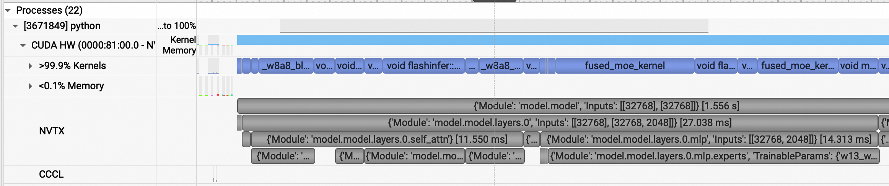
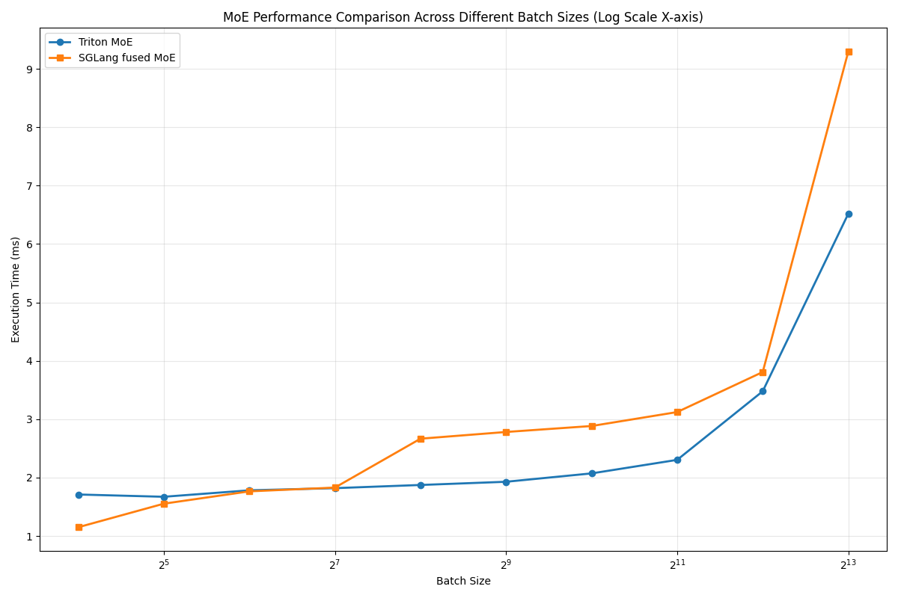

# Fused MoE Kernels

## Sglang

Sglang 的 MoE kernel 选取可见 `python/sglang/srt/layers/moe/ep_moe/layer.py` 的 `get_moe_impl_class()`.

- DeepEPMoE：需要 DeepEP 或 Mooncake 的 A2A backend
- FlashInferFP4MoE：需要 SM100 和 ModelOptNvFp4FusedMoEMethod 量化，后端调用 trtllm_fp4_block_scale_moe
- FlashInferFusedMoE：需要 SM100，后端调用 trtllm_bf16_moe
- FlashInferCutlass：可能暂未支持，目前路由到 FusedMoE
- FusedMoE：Triton kernel

另外，[这个 commit](https://github.com/sgl-project/sglang/pull/7689) 新增了一种 Triton kernel，使用了 triton-kernels 这个包中的 MoE 实现。
目前未被加入可选后端。

## vLLM

vLLM 的 MoE 封装成 Fused MoE Modular Kernel, 包含三个模块：

1. TopKWeightAndReduce：A2A combine 之前的 reduce
2. FusedMoEPrepareAndFinalize：动态激活量化，A2A dispatch 和 combine
3. FusedMoEPermuteExpertsUnpermute: 一般意义上的 Fused MoE Kernel

这里，我们仅关注 FusedMoEPermuteExpertsUnpermute 模块，它包含了 Fused MoE 的核心逻辑。

From `moe_kernel_features.md` in v0.15.0:

| Kernel | Input act. format | Quant. types | Quant. format | Activation function | Apply Weight On Input | Modular | Source |
|--------|-------------------|--------------|---------------|---------------------|-----------------------|---------|--------|
| triton | standard | all<sup>1</sup> | G,A,T | silu, gelu,</br>swigluoai,</br>silu_no_mul,</br>gelu_no_mul | Y | Y | [`fused_experts`][vllm.model_executor.layers.fused_moe.fused_moe.fused_experts],</br>[`TritonExperts`][vllm.model_executor.layers.fused_moe.fused_moe.TritonExperts] |
| triton (batched) | batched | all<sup>1</sup> | G,A,T | silu, gelu | <sup>6</sup> | Y | [`BatchedTritonExperts`][vllm.model_executor.layers.fused_moe.fused_batched_moe.BatchedTritonExperts] |
| deep gemm | standard,</br>batched | fp8 | G(128),A,T | silu, gelu | <sup>6</sup> | Y | </br>[`DeepGemmExperts`][vllm.model_executor.layers.fused_moe.deep_gemm_moe.DeepGemmExperts],</br>[`BatchedDeepGemmExperts`][vllm.model_executor.layers.fused_moe.batched_deep_gemm_moe.BatchedDeepGemmExperts] |
| cutlass_fp4 | standard,</br>batched | nvfp4 | A,T | silu | Y | Y | [`CutlassExpertsFp4`][vllm.model_executor.layers.fused_moe.cutlass_moe.CutlassExpertsFp4] |
| cutlass_fp8 | standard,</br>batched | fp8 | A,T | silu, gelu | Y | Y | [`CutlassExpertsFp8`][vllm.model_executor.layers.fused_moe.cutlass_moe.CutlassExpertsFp8],</br>[`CutlasBatchedExpertsFp8`][vllm.model_executor.layers.fused_moe.cutlass_moe.CutlassBatchedExpertsFp8] |
| flashinfer | standard | nvfp4,</br>fp8 | T | <sup>5</sup> | N | Y | [`FlashInferExperts`][vllm.model_executor.layers.fused_moe.flashinfer_cutlass_moe.FlashInferExperts] |
| gpt oss triton | standard | N/A | N/A | <sup>5</sup> | Y | Y | [`triton_kernel_fused_experts`][vllm.model_executor.layers.fused_moe.gpt_oss_triton_kernels_moe.triton_kernel_fused_experts],</br>[`OAITritonExperts`][vllm.model_executor.layers.fused_moe.gpt_oss_triton_kernels_moe.OAITritonExperts] |
| marlin | standard,</br>batched | <sup>3</sup> / N/A | <sup>3</sup> / N/A | silu,</br>swigluoai | Y | Y | [`fused_marlin_moe`][vllm.model_executor.layers.fused_moe.fused_marlin_moe.fused_marlin_moe],</br>[`MarlinExperts`][vllm.model_executor.layers.fused_moe.fused_marlin_moe.MarlinExperts],</br>[`BatchedMarlinExperts`][vllm.model_executor.layers.fused_moe.fused_marlin_moe.BatchedMarlinExperts] |
| trtllm | standard | mxfp4,</br>nvfp4 | G(16),G(32) | <sup>5</sup> | N | Y | [`TrtLlmGenExperts`][vllm.model_executor.layers.fused_moe.trtllm_moe.TrtLlmGenExperts] |
| rocm aiter moe | standard | fp8 | G(128),A,T | silu, gelu | Y | N | [`rocm_aiter_fused_experts`][vllm.model_executor.layers.fused_moe.rocm_aiter_fused_moe.rocm_aiter_fused_experts] |
| cpu_fused_moe | standard | N/A | N/A | silu | N | N | [`CPUFusedMOE`][vllm.model_executor.layers.fused_moe.cpu_fused_moe.CPUFusedMOE] |
| naive batched<sup>4</sup> | batched | int8,</br>fp8 | G,A,T | silu, gelu | <sup>6</sup> | Y | [`NaiveBatchedExperts`][vllm.model_executor.layers.fused_moe.fused_batched_moe.NaiveBatchedExperts] |

1. All types: mxfp4, nvfp4, int4, int8, fp8
2. A dispatcher wrapper around triton and deep gemm experts. Will select based on type + shape + quantization params
3. uint4, uint8, fp8, fp4
4. This is a naive implementation of experts that supports batched format. Mainly used for testing.
5. The `activation` parameter is ignored and SwiGlu is used by default instead.
6. Only handled by or supported when used with modular kernels.

可用组合：

| backend | `FusedMoEPrepareAndFinalize` subclasses | `FusedMoEPermuteExpertsUnpermute` subclasses |
|---------|-----------------------------------------|----------------------------------------------|
| deepep_high_throughput | `DeepEPHTPrepareAndFinalize` |  `DeepGemmExperts`,</br>`TritonExperts`,</br>`TritonOrDeepGemmExperts`,</br>`CutlassExpertsFp8`, </br>`MarlinExperts` |
| deepep_low_latency,</br>pplx | `DeepEPLLPrepareAndFinalize`,</br>`PplxPrepareAndFinalize` |  `BatchedDeepGemmExperts`,</br>`BatchedTritonExperts`,</br>`CutlassBatchedExpertsFp8`,</br>`BatchedMarlinExperts` |
| flashinfer | `FlashInferCutlassMoEPrepareAndFinalize` | `FlashInferExperts` |

## Profile

- 1x L40 GPU
- Sglang v0.5.7 installed locally
- Sgl-kernel v0.3.20
- Qwen3-30B-A3B-Instruct-2507-FP8

```bash
#!/bin/bash

/home/zhouhaoyun/tools/nsight-systems/opt/nvidia/nsight-systems-cli/2026.1.1/bin/nsys profile \
    --trace-fork-before-exec=true \
    --cuda-graph-trace=node \
    --capture-range=cudaProfilerApi \
    --capture-range-end=stop \
    python -m sglang.bench_one_batch --model-path ../models/Qwen3-30B-A3B-Instruct-2507-FP8 \
    --batch 16 --input-len 2048 --output-len 512 \
    --enable-layerwise-nvtx-marker \
    --profile \
    --profile-activities CUDA_PROFILER
```



- FP8 GEMM: `_w8a8_block_fp8_matmul` (Triton)
- Attention:
    - Prefill: `flashinfer::BatchPrefillWithRaggedKVCacheKernel`
    - Decode: `flashinfer::BatchPrefillWithPagedKVCacheKernel`
- MoE: `fused_moe_kernel` (Triton)

### Prefill

｜ Range | Time (ms) | Percent |
|-----|------|---------|
| layers.0 | 27.038 | 100\% |
| self_attn | 11.550 | 42.7\% |
| mlp | 14.313 | 52.9\% |
| fused_moe_kernel w13 | 5.887 | 21.8\% |
| fused_moe_kernel w2 | 3.408 | 12.6\% |

> self_attn 和 mlp 不包含 pre- 和 post-attention layernorm

### Decode

｜ Range | Time (ms) | Percent |
|-----|------|---------|
| layers.0 | 0.427 | 100\% |
| self_attn | 0.175 | 40.9\% |
| mlp | 0.251 | 58.7\% |
| fused_moe_kernel w13 | 0.163 | 38.1\% |
| fused_moe_kernel w2 | 0.068 | 15.9\% |

## W16A16 Kernel Benchmark

### Fused MoE

```
moe_align_block_size -> fused_moe_kernel -> silu_and_mul -> fused_moe_kernel
```

### Triton-Kernels MoE

```
┌─────────────────────────────────────────────────────────────────────────────────────────────────────────────────────────────┐
│                                                      TritonKernelTopKOutput                                                 │
├─────────────────────────────────────────────────────────────────────────────────────────────────────────────────────────────┤
│                                                                                                                             │
│   ┌───────────────────┐          ┌───────────────────┐          ┌───────────────────┐                                       │
│   │    routing_data   │          │     gather_idx    │          │    scatter_idx    │                                       │
│   │    :RoutingData   │          │    :GatherIndx    │          │   :ScatterIndx    │                                       │
│   └─────────┬─────────┘          └─────────┬─────────┘          └─────────┬─────────┘                                       │
│             │                              │                              │                                                 │
└─────────────┼──────────────────────────────┼──────────────────────────────┼─────────────────────────────────────────────────┘
              │                              │                              │
              ▼                              ▼                              ▼
┌──────────────────────────────┐  ┌──────────────────────────────┐  ┌──────────────────────────────┐
│        RoutingData           │  │         GatherIndx           │  │        ScatterIndx           │
│                              │  │                              │  │                              │
│  gate_scal      : T          │  │  src_idx        : T          │  │  src_idx        : T          │
│  expt_hist      : T          │  │  dst_idx        : T          │  │  dst_idx        : T          │
│  n_expts_tot    : int        │  └──────────────────────────────┘  └──────────────────────────────┘
│  n_expts_act    : int        │               │                              │
│  expt_data      : ExptData   │               │                              │
│  expected_tokens_per_expt: int               │                              │
└───────────────────┬──────────┘               │                              │
                    │                          │                              │
                    ▼                          │                              │
        ┌───────────────────────┐              │                              │
        │       ExptData        │              │                              │
        │                       │              │                              │
        │  hist             : T │              │                              │
        │  token_offs_raw   : T │              │                              │
        │  token_offs_pad   : dict             │                              │
        │  block_pid_map    : dict             │                              │
        └───────────────────────┘              │                              │
                                               │                              │
                                               ▼                              ▼
                                    ┌──────────────────────┐      ┌──────────────────────┐
                                    │      Operation       │      │      Operation       │
                                    │                      │      │                      │
                                    │   Y = X[src_idx, :]  │      │  Y[dst_idx, :] = X   │
                                    └──────────────────────┘      └──────────────────────┘
```

```
matmul_ogs (gather_idx) -> silu_and_mul -> matmul_ogs (scatter_idx)
```

### 0x00



```
================================================================================
FINAL SUMMARY - Performance Comparison Across Batch Sizes
================================================================================
Batch Size   Triton (ms)     SGLang (ms)     Speedup
--------------------------------------------------------------------------------
16           1.694           1.150           0.68      x
32           1.694           1.554           0.92      x
64           1.778           1.767           0.99      x
128          1.820           1.830           1.01      x
256          1.867           2.673           1.43      x
512          1.929           2.787           1.44      x
1024         2.069           2.884           1.39      x
2048         2.300           3.111           1.35      x
4096         3.230           3.984           1.23      x
8192         5.734           9.158           1.60      x
================================================================================
```

- 在 m=16,32 时，sgl 的 fused_moe_kernel 优于 triton-kernel 的 matmul_ogs。
- 在 m=64,128 时，二者无明显差异。
- 在 m>=256 时，matmul_ogs 优于 fused_moe_kernel。

我们以 m=16 和 m=8192 的 w13 为例，分析二者的差异。

｜ Item | fused_moe M=16 | fused_moe M=8192 | matmul_ogs M=16 | matmul_ogs M=8192 |
|-|-|-|-|-|
| Time (ms) | 0.735 | 5.610 | 0.706 | 3.308 |
| Grid Size | 6144 | 27624 | 1536 | 3834 |
| Block Size | 128 | 128 | 128 | 256 |
| Compute | 19.63\% | 91.84\% | 20.98\% | 93.18\% |
| Memory  | 94.82\% | 44.75\% | 94.57\% | 17.48\% |

注意到在 M=8192 时，fused_moe 的访存吞吐大于 matmul_ogs 的两倍，而计算吞吐都接近上限。
可见 fused_moe 的访存量过大。

首先，从每个 CTA 负责的 Block size 开始分析。
在默认情况下，fused_moe 的 MNK Block size 始终为 [64, 64, 32]。
matmul_ops 的 MNK Block size：

- M <= 128: [16, 256, 64]
- M = 512: [32, 256, 64]
- M >= 1024: [64, 256, 64]