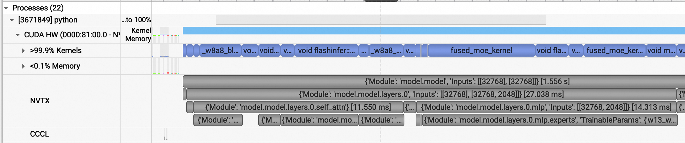
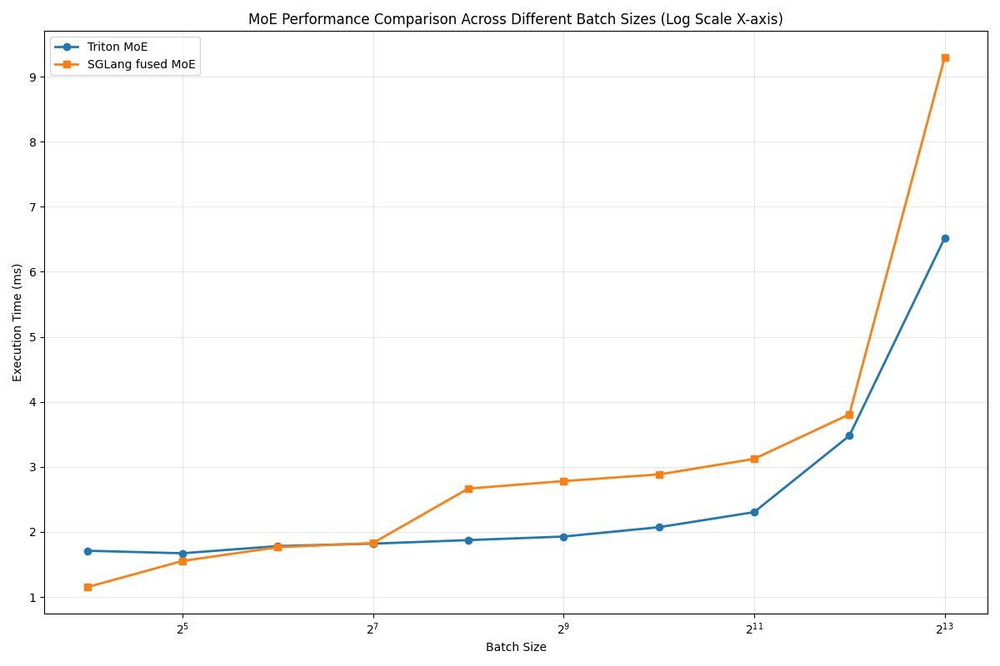
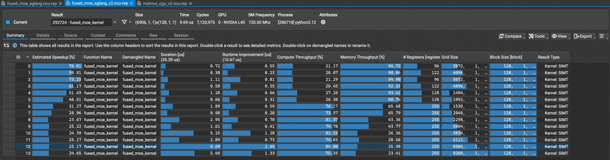
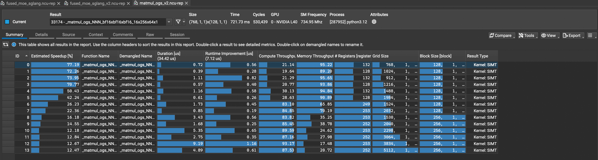

# Fused MoE Kernels

## Sglang

Sglang 的 MoE kernel 选取可见 `python/sglang/srt/layers/moe/ep_moe/layer.py` 的 `get_moe_impl_class()`.

- DeepEPMoE：需要 DeepEP 或 Mooncake 的 A2A backend
- FlashInferFP4MoE：需要 SM100 和 ModelOptNvFp4FusedMoEMethod 量化，后端调用 trtllm_fp4_block_scale_moe
- FlashInferFusedMoE：需要 SM100，后端调用 trtllm_bf16_moe
- FlashInferCutlass：可能暂未支持，目前路由到 FusedMoE
- FusedMoE：Triton kernel

另外，[这个 commit](https://github.com/sgl-project/sglang/pull/7689) 新增了一种 Triton kernel，使用了 triton-kernels 这个包中的 MoE 实现。
目前未被加入可选后端。

## vLLM

vLLM 的 MoE 封装成 Fused MoE Modular Kernel, 包含三个模块：

1. TopKWeightAndReduce：A2A combine 之前的 reduce
2. FusedMoEPrepareAndFinalize：动态激活量化，A2A dispatch 和 combine
3. FusedMoEPermuteExpertsUnpermute: 一般意义上的 Fused MoE Kernel

这里，我们仅关注 FusedMoEPermuteExpertsUnpermute 模块，它包含了 Fused MoE 的核心逻辑。

From `moe_kernel_features.md` in v0.15.0:

| Kernel | Input act. format | Quant. types | Quant. format | Activation function | Apply Weight On Input | Modular | Source |
|--------|-------------------|--------------|---------------|---------------------|-----------------------|---------|--------|
| triton | standard | all<sup>1</sup> | G,A,T | silu, gelu,</br>swigluoai,</br>silu_no_mul,</br>gelu_no_mul | Y | Y | [`fused_experts`][vllm.model_executor.layers.fused_moe.fused_moe.fused_experts],</br>[`TritonExperts`][vllm.model_executor.layers.fused_moe.fused_moe.TritonExperts] |
| triton (batched) | batched | all<sup>1</sup> | G,A,T | silu, gelu | <sup>6</sup> | Y | [`BatchedTritonExperts`][vllm.model_executor.layers.fused_moe.fused_batched_moe.BatchedTritonExperts] |
| deep gemm | standard,</br>batched | fp8 | G(128),A,T | silu, gelu | <sup>6</sup> | Y | </br>[`DeepGemmExperts`][vllm.model_executor.layers.fused_moe.deep_gemm_moe.DeepGemmExperts],</br>[`BatchedDeepGemmExperts`][vllm.model_executor.layers.fused_moe.batched_deep_gemm_moe.BatchedDeepGemmExperts] |
| cutlass_fp4 | standard,</br>batched | nvfp4 | A,T | silu | Y | Y | [`CutlassExpertsFp4`][vllm.model_executor.layers.fused_moe.cutlass_moe.CutlassExpertsFp4] |
| cutlass_fp8 | standard,</br>batched | fp8 | A,T | silu, gelu | Y | Y | [`CutlassExpertsFp8`][vllm.model_executor.layers.fused_moe.cutlass_moe.CutlassExpertsFp8],</br>[`CutlasBatchedExpertsFp8`][vllm.model_executor.layers.fused_moe.cutlass_moe.CutlassBatchedExpertsFp8] |
| flashinfer | standard | nvfp4,</br>fp8 | T | <sup>5</sup> | N | Y | [`FlashInferExperts`][vllm.model_executor.layers.fused_moe.flashinfer_cutlass_moe.FlashInferExperts] |
| gpt oss triton | standard | N/A | N/A | <sup>5</sup> | Y | Y | [`triton_kernel_fused_experts`][vllm.model_executor.layers.fused_moe.gpt_oss_triton_kernels_moe.triton_kernel_fused_experts],</br>[`OAITritonExperts`][vllm.model_executor.layers.fused_moe.gpt_oss_triton_kernels_moe.OAITritonExperts] |
| marlin | standard,</br>batched | <sup>3</sup> / N/A | <sup>3</sup> / N/A | silu,</br>swigluoai | Y | Y | [`fused_marlin_moe`][vllm.model_executor.layers.fused_moe.fused_marlin_moe.fused_marlin_moe],</br>[`MarlinExperts`][vllm.model_executor.layers.fused_moe.fused_marlin_moe.MarlinExperts],</br>[`BatchedMarlinExperts`][vllm.model_executor.layers.fused_moe.fused_marlin_moe.BatchedMarlinExperts] |
| trtllm | standard | mxfp4,</br>nvfp4 | G(16),G(32) | <sup>5</sup> | N | Y | [`TrtLlmGenExperts`][vllm.model_executor.layers.fused_moe.trtllm_moe.TrtLlmGenExperts] |
| rocm aiter moe | standard | fp8 | G(128),A,T | silu, gelu | Y | N | [`rocm_aiter_fused_experts`][vllm.model_executor.layers.fused_moe.rocm_aiter_fused_moe.rocm_aiter_fused_experts] |
| cpu_fused_moe | standard | N/A | N/A | silu | N | N | [`CPUFusedMOE`][vllm.model_executor.layers.fused_moe.cpu_fused_moe.CPUFusedMOE] |
| naive batched<sup>4</sup> | batched | int8,</br>fp8 | G,A,T | silu, gelu | <sup>6</sup> | Y | [`NaiveBatchedExperts`][vllm.model_executor.layers.fused_moe.fused_batched_moe.NaiveBatchedExperts] |

1. All types: mxfp4, nvfp4, int4, int8, fp8
2. A dispatcher wrapper around triton and deep gemm experts. Will select based on type + shape + quantization params
3. uint4, uint8, fp8, fp4
4. This is a naive implementation of experts that supports batched format. Mainly used for testing.
5. The `activation` parameter is ignored and SwiGlu is used by default instead.
6. Only handled by or supported when used with modular kernels.

可用组合：

| backend | `FusedMoEPrepareAndFinalize` subclasses | `FusedMoEPermuteExpertsUnpermute` subclasses |
|---------|-----------------------------------------|----------------------------------------------|
| deepep_high_throughput | `DeepEPHTPrepareAndFinalize` |  `DeepGemmExperts`,</br>`TritonExperts`,</br>`TritonOrDeepGemmExperts`,</br>`CutlassExpertsFp8`, </br>`MarlinExperts` |
| deepep_low_latency,</br>pplx | `DeepEPLLPrepareAndFinalize`,</br>`PplxPrepareAndFinalize` |  `BatchedDeepGemmExperts`,</br>`BatchedTritonExperts`,</br>`CutlassBatchedExpertsFp8`,</br>`BatchedMarlinExperts` |
| flashinfer | `FlashInferCutlassMoEPrepareAndFinalize` | `FlashInferExperts` |

## Profile

- 1x L40 GPU
- Sglang v0.5.7 installed locally
- Sgl-kernel v0.3.20
- Qwen3-30B-A3B-Instruct-2507-FP8

```bash
#!/bin/bash

/home/zhouhaoyun/tools/nsight-systems/opt/nvidia/nsight-systems-cli/2026.1.1/bin/nsys profile \
    --trace-fork-before-exec=true \
    --cuda-graph-trace=node \
    --capture-range=cudaProfilerApi \
    --capture-range-end=stop \
    python -m sglang.bench_one_batch --model-path ../models/Qwen3-30B-A3B-Instruct-2507-FP8 \
    --batch 16 --input-len 2048 --output-len 512 \
    --enable-layerwise-nvtx-marker \
    --profile \
    --profile-activities CUDA_PROFILER
```



- FP8 GEMM: `_w8a8_block_fp8_matmul` (Triton)
- Attention:
    - Prefill: `flashinfer::BatchPrefillWithRaggedKVCacheKernel`
    - Decode: `flashinfer::BatchPrefillWithPagedKVCacheKernel`
- MoE: `fused_moe_kernel` (Triton)

### Prefill

｜ Range | Time (ms) | Percent |
|-----|------|---------|
| layers.0 | 27.038 | 100\% |
| self_attn | 11.550 | 42.7\% |
| mlp | 14.313 | 52.9\% |
| fused_moe_kernel w13 | 5.887 | 21.8\% |
| fused_moe_kernel w2 | 3.408 | 12.6\% |

> self_attn 和 mlp 不包含 pre- 和 post-attention layernorm

### Decode

｜ Range | Time (ms) | Percent |
|-----|------|---------|
| layers.0 | 0.427 | 100\% |
| self_attn | 0.175 | 40.9\% |
| mlp | 0.251 | 58.7\% |
| fused_moe_kernel w13 | 0.163 | 38.1\% |
| fused_moe_kernel w2 | 0.068 | 15.9\% |

## W16A16 Kernel Benchmark

### Fused MoE

```
moe_align_block_size -> fused_moe_kernel -> silu_and_mul -> fused_moe_kernel
```

### Triton-Kernels MoE

```
┌─────────────────────────────────────────────────────────────────────────────────────────────────────────────────────────────┐
│                                                      TritonKernelTopKOutput                                                 │
├─────────────────────────────────────────────────────────────────────────────────────────────────────────────────────────────┤
│                                                                                                                             │
│   ┌───────────────────┐          ┌───────────────────┐          ┌───────────────────┐                                       │
│   │    routing_data   │          │     gather_idx    │          │    scatter_idx    │                                       │
│   │    :RoutingData   │          │    :GatherIndx    │          │   :ScatterIndx    │                                       │
│   └─────────┬─────────┘          └─────────┬─────────┘          └─────────┬─────────┘                                       │
│             │                              │                              │                                                 │
└─────────────┼──────────────────────────────┼──────────────────────────────┼─────────────────────────────────────────────────┘
              │                              │                              │
              ▼                              ▼                              ▼
┌──────────────────────────────┐  ┌──────────────────────────────┐  ┌──────────────────────────────┐
│        RoutingData           │  │         GatherIndx           │  │        ScatterIndx           │
│                              │  │                              │  │                              │
│  gate_scal      : T          │  │  src_idx        : T          │  │  src_idx        : T          │
│  expt_hist      : T          │  │  dst_idx        : T          │  │  dst_idx        : T          │
│  n_expts_tot    : int        │  └──────────────────────────────┘  └──────────────────────────────┘
│  n_expts_act    : int        │               │                              │
│  expt_data      : ExptData   │               │                              │
│  expected_tokens_per_expt: int               │                              │
└───────────────────┬──────────┘               │                              │
                    │                          │                              │
                    ▼                          │                              │
        ┌───────────────────────┐              │                              │
        │       ExptData        │              │                              │
        │                       │              │                              │
        │  hist             : T │              │                              │
        │  token_offs_raw   : T │              │                              │
        │  token_offs_pad   : dict             │                              │
        │  block_pid_map    : dict             │                              │
        └───────────────────────┘              │                              │
                                               │                              │
                                               ▼                              ▼
                                    ┌──────────────────────┐      ┌──────────────────────┐
                                    │      Operation       │      │      Operation       │
                                    │                      │      │                      │
                                    │   Y = X[src_idx, :]  │      │  Y[dst_idx, :] = X   │
                                    └──────────────────────┘      └──────────────────────┘
```

```
matmul_ogs (gather_idx) -> silu_and_mul -> matmul_ogs (scatter_idx)
```

### 0x00



```
================================================================================
FINAL SUMMARY - Performance Comparison Across Batch Sizes
================================================================================
Batch Size   Triton (ms)     SGLang (ms)     Speedup
--------------------------------------------------------------------------------
16           1.714           1.150           0.67      x
32           1.690           1.555           0.92      x
64           1.779           1.766           0.99      x
128          1.818           1.828           1.01      x
256          1.867           2.673           1.43      x
512          1.927           2.786           1.45      x
1024         2.069           2.882           1.39      x
2048         2.301           3.108           1.35      x
4096         3.230           3.614           1.12      x
8192         5.767           8.607           1.49      x
================================================================================
```

- 在 m=16,32 时，sgl 的 fused_moe_kernel 优于 triton-kernel 的 matmul_ogs。
- 在 m=64,128 时，二者无明显差异。
- 在 m>=256 时，matmul_ogs 优于 fused_moe_kernel。

我们以 m=16 和 m=8192 的 w13 为例，分析二者的差异。

| Item | fused_moe M=16 | fused_moe M=8192 | matmul_ogs M=16 | matmul_ogs M=8192 |
|-|-|-|-|-|
| Time (ms) | 0.735 | 5.610 | 0.706 | 3.308 |
| Grid Size | 6144 | 27624 | 1536 | 3834 |
| Block Size | 128 | 128 | 128 | 256 |
| Compute | 19.63\% | 91.84\% | 20.98\% | 93.18\% |
| Memory  | 94.82\% | 44.75\% | 94.57\% | 17.48\% |
| Active Warps per SM | 28 | 20 | 8 | 8 |

注意到在 M=8192 时，fused_moe 的访存吞吐大于 matmul_ogs 的两倍，而计算吞吐都接近上限。
可见对于 M 较大的情况，fused_moe 的访存量过大了。

首先，从每个 CTA 负责的 Block size 开始分析。
在默认情况下，fused_moe 的 MNK Block size 始终为 [64, 64, 32]。
matmul_ops 的 MNK Block size：

- M <= 128: [16, 256, 64]
    - M = 16: Split-K = 2
- M = 512: [32, 256, 64]
- M >= 1024: [64, 256, 64]

可以观察到：

1. M = 16 时 matmul_ops 开启了 Split-K = 2，这是不必要的。
在 `opt_flags.py` 中，预估 Grid Size 的值的时候，M 方向的分块数是直接将 M * Topk 除以 bM。
在小 Batch size 时，这与实际的分块数相差非常大。
M = 16 时，预估的 Grid Size 为 `(16 x 8 / 16) x (2048 / 256) = 64`。
但实际扣除 Split-K 的影响之后的 Grid Size 大小达到了 768 (ncu) 或 1024 (triton)，这是远大于 SM 数量的，开启 Split-K 会造成负优化。

2. fused_moe 的 MNK Block size 太小。
在 Grid Size 能够填满 SM 数量，尤其在 Batch size 较大时，应该使用更大的 MNK Block Size。

3. Block_M 的选择：
matmul_ops 根据每个专家平均被路由到的 Token 个数来决定 Block_M。
当 M = 512 时，平均每个专家的 M = 512 x 8 / 128 = 32。
当 M = 1024 时，平均每个专家的 M = 1024 x 8 / 128 = 64。
这一策略基本合理，也可以考虑适当调小 Block_M，以应对较多专家的 M 维度不对齐的情况。

### 0x01. 取消 matmul_ogs 的 Split-K

更改：设定 Split-K = 1

```py
opt_flags.update_opt_flags_constraints(
    {
        "split_k": 1,
    }
)
```

```
================================================================================
FINAL SUMMARY - Performance Comparison Across Batch Sizes
================================================================================
Batch Size   Triton v2 (ms)  SGLang (ms)     Speedup
--------------------------------------------------------------------------------
16           1.611           1.151           0.71      x
32           1.682           1.554           0.92      x
64           1.779           1.765           0.99      x
128          1.820           1.828           1.00      x
256          1.867           2.671           1.43      x
512          1.926           2.791           1.45      x
1024         2.070           2.884           1.39      x
2048         2.298           3.110           1.35      x
4096         3.214           3.682           1.15      x
8192         5.742           8.581           1.49      x
================================================================================
```

M=16 提升了 (1.714 - 1.611) / 1.714 = 6.0\%。

### 0x02. 增大 fused_moe 的 Block Size

```json
// E=128,N=768,device_name=NVIDIA_L40.json
{
    "16": {
        "BLOCK_SIZE_M": 16,
        "BLOCK_SIZE_N": 64,
        "BLOCK_SIZE_K": 256,
        "GROUP_SIZE_M": 32,
        "num_warps": 4,
        "num_stages": 3
    },
    "256": {
        "BLOCK_SIZE_M": 16,
        "BLOCK_SIZE_N": 256,
        "BLOCK_SIZE_K": 64,
        "GROUP_SIZE_M": 32,
        "num_warps": 4,
        "num_stages": 3
    },
    "512": {
        "BLOCK_SIZE_M": 32,
        "BLOCK_SIZE_N": 256,
        "BLOCK_SIZE_K": 64,
        "GROUP_SIZE_M": 32,
        "num_warps": 4,
        "num_stages": 3
    },
    "1024": {
        "BLOCK_SIZE_M": 64,
        "BLOCK_SIZE_N": 256,
        "BLOCK_SIZE_K": 64,
        "GROUP_SIZE_M": 32,
        "num_warps": 4,
        "num_stages": 3
    },
    ...
    "8192": {
        "BLOCK_SIZE_M": 64,
        "BLOCK_SIZE_N": 256,
        "BLOCK_SIZE_K": 64,
        "GROUP_SIZE_M": 32,
        "num_warps": 4,
        "num_stages": 3
    }
}
```

```
================================================================================
FINAL SUMMARY - Performance Comparison Across Batch Sizes
================================================================================
Batch Size   Triton v2 (ms)  SGLang v2 (ms)  Speedup
--------------------------------------------------------------------------------
16           1.607           1.096           0.68      x
32           1.669           1.486           0.89      x
64           1.785           1.688           0.95      x
128          1.821           1.736           0.95      x
256          1.870           1.953           1.04      x
512          1.930           2.023           1.05      x
1024         2.082           2.172           1.04      x
2048         2.303           2.444           1.06      x
4096         3.219           3.529           1.10      x
8192         5.754           6.733           1.17      x
================================================================================
```

### 0x03. fused_moe 爆寄存器





fused_moe 在 BS>=1024 开始出现爆寄存器现象，使用寄存器数量为 255，且在 NCU Memory Profiling 中出现 Local Load，
表明出现了寄存器溢出，退化成 Global Load。
考虑减小 BS>=1024 的 Block Size（减小至 32x256x64 还是 64x128x64 ?）

32x256x64 Stages=3:

```
================================================================================
FINAL SUMMARY - Performance Comparison Across Batch Sizes
================================================================================
Batch Size   Triton (ms)     SGLang (ms)     Speedup
--------------------------------------------------------------------------------
16           1.637           1.096           0.67      x
32           1.684           1.488           0.88      x
64           1.778           1.687           0.95      x
128          1.821           1.736           0.95      x
256          1.869           1.954           1.05      x
512          1.930           2.020           1.05      x
1024         2.071           2.129           1.03      x
2048         2.301           2.389           1.04      x
4096         3.252           4.047           1.24      x
8192         5.791           8.153           1.41      x
================================================================================
```

64x128x64 Stages=3:

```
================================================================================
FINAL SUMMARY - Performance Comparison Across Batch Sizes
================================================================================
Batch Size   Triton (ms)     SGLang (ms)     Speedup
--------------------------------------------------------------------------------
16           1.632           1.097           0.67      x
32           1.686           1.487           0.88      x
64           1.780           1.689           0.95      x
128          1.818           1.735           0.95      x
256          1.868           1.953           1.05      x
512          1.927           2.019           1.05      x
1024         2.069           2.144           1.04      x
2048         2.301           2.405           1.05      x
4096         3.241           3.043           0.94      x
8192         5.807           6.607           1.14      x
================================================================================
```

64x256x64 Stages=2:

```
================================================================================
FINAL SUMMARY - Performance Comparison Across Batch Sizes
================================================================================
Batch Size   Triton (ms)     SGLang (ms)     Speedup
--------------------------------------------------------------------------------
16           1.633           1.095           0.67      x
32           1.681           1.487           0.88      x
64           1.778           1.687           0.95      x
128          1.820           1.735           0.95      x
256          1.867           1.953           1.05      x
512          1.925           2.018           1.05      x
1024         2.065           2.201           1.07      x
2048         2.301           2.484           1.08      x
4096         3.221           3.243           1.01      x
8192         5.743           6.451           1.12      x
================================================================================
```

SGLang fused_moe v3: 1024<=BS<=4096 使用 64x128x64 Stages=3, BS=8192 使用 64x256x64 Stages=2。
修改后 Local Load 为零，避免了寄存器溢出。

V3 结果：

| Batch Size | Triton (初始) | Triton (优化) | Triton 优化率 | SGLang (初始) | SGLang (优化) | SGLang 优化率 | 优化后 SGLang vs Triton |
|------------|---------------|---------------|---------------|---------------|---------------|---------------|----------------|
| 16         | 1.714         | 1.633         | 4.73%         | 1.150         | 1.096         | 4.70%         | 0.67 x         |
| 32         | 1.690         | 1.686         | 0.24%         | 1.555         | 1.487         | 4.37%         | 0.88 x         |
| 64         | 1.779         | 1.779         | 0.00%         | 1.766         | 1.690         | 4.31%         | 0.95 x         |
| 128        | 1.818         | 1.821         | -0.17%        | 1.828         | 1.735         | 5.09%         | 0.95 x         |
| 256        | 1.867         | 1.870         | -0.16%        | 2.673         | 2.002         | 25.10%        | 1.07 x         |
| 512        | 1.927         | 1.934         | -0.36%        | 2.786         | 2.019         | 27.53%        | 1.04 x         |
| 1024       | 2.069         | 2.069         | 0.00%         | 2.882         | 2.202         | 23.59%        | 1.06 x         |
| 2048       | 2.301         | 2.302         | -0.04%        | 3.108         | 2.482         | 20.14%        | 1.08 x         |
| 4096       | 3.230         | 3.234         | -0.12%        | 3.614         | 3.448         | 4.59%         | 1.07 x         |
| 8192       | 5.767         | 5.748         | 0.33%         | 8.607         | 6.355         | 26.17%        | 1.11 x         |

### 0x04. NCU 测出的耗时不准

Using v2:

| Batch Size | NCU 测量耗时 (ms) | CUDA Event 测量耗时 (ms) | 差值 (ms) | 差值百分比 (%) |
|------------|-------------------|--------------------------|-----------|----------------|
| 16         | 0.72              | 0.7578                   | -0.0378   | -4.99          |
| 64         | 1.11              | 1.1428                   | -0.0328   | -2.87          |
| 256        | 1.28              | 1.3140                   | -0.0340   | -2.59          |
| 1024       | 1.89              | 1.4121                   | 0.4779    | 33.84          |
| 2048       | 2.95              | 1.5053                   | 1.4447    | 95.97          |
| 4096       | 5.25              | 1.8972                   | 3.3528    | 176.72         |
| 8192       | 9.69              | 3.5809                   | 6.1091    | 170.60         |

From LLM:

NCU在收集详细metric时会：

- 注入额外指令和缓冲区管理代码
- 强制刷新L1/L2缓存以确保计数准确 
- 锁定GPU时钟频率防止动态调频干扰 

大batch kernel占用更多SM、显存带宽和cache，这些profiling操作的开销会被放大，导致测量值虚高。

> [https://docs.nvidia.com/nsight-compute/ProfilingGuide/index.html#overhead]

### 0x05. flashinfer_cutlass_fused_moe

```
====================================================================================================
FINAL SUMMARY - Performance Comparison Across Batch Sizes
====================================================================================================
Batch Size   Triton (ms)     SGLang (ms)     FlashInf (ms)   T/Sgl      F/Sgl
----------------------------------------------------------------------------------------------------
16           1.622           1.092           1.131           0.67       0.97
32           1.675           1.483           1.529           0.89       0.97
64           1.781           1.689           1.740           0.95       0.97
128          1.821           1.735           1.795           0.95       0.97
256          1.870           1.946           1.884           1.04       1.03
512          1.935           2.011           1.939           1.04       1.04
1024         2.069           2.125           2.047           1.03       1.04
2048         2.305           2.380           2.360           1.03       1.01
4096         3.250           3.989           4.619           1.23       0.86
8192         5.792           6.324           9.087           1.09       0.70
====================================================================================================
```

在 BS<=2048 时，cutlass_moe 与 sgl fused_moe 性能没有明显差异。
在 BS>=4096 时，cutlass_moe 的性能是比 sgl fused_moe 差的，比 triton_kernels 就更差一截了。