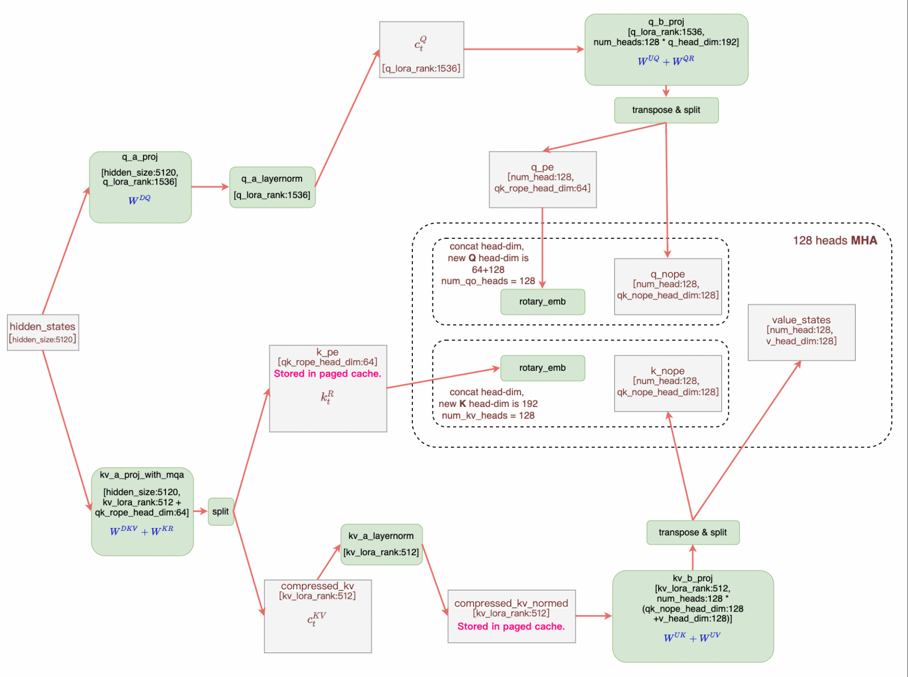
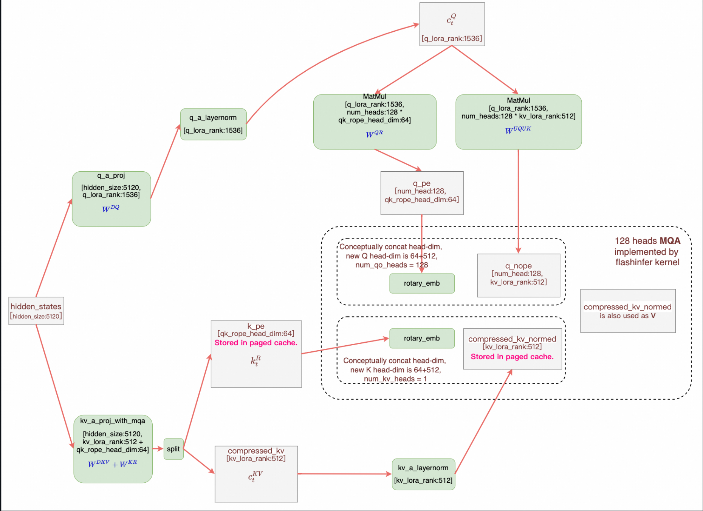

# Multi-head Latent Attention (MLA)

## Transformers

### DeepSeekV3 Configuration
```
hidden_size = 7168
q_lora_rank = 1536
num_heads   = 128
qk_nope_head_dim = 128
qk_rope_head_dim = 64
qk_head_dim = qk_nope_head_dim + qk_rope_head_dim = 192
v_head_dim = 128
```

### DeepSeekV3 Attention

```python
query_shape = (batch_size, seq_length, -1, self.qk_head_dim)
key_shape = (batch_size, seq_length, -1, self.qk_nope_head_dim + self.v_head_dim)

if self.q_lora_rank is None:
    q_states = self.q_proj(hidden_states)  # [b, s, h * qk_head_dim]
else:
    q_states = self.q_b_proj(self.q_a_layernorm(self.q_a_proj(hidden_states)))
        # q_a_proj: [b, s, d] -> [b, s, q_lora_rank]   (16x down_proj)
        # q_b_proj: [b, s, q_lora_rank] -> [b, s, h * qk_head_dim]  (16x up_proj)

q_states = q_states.view(query_shape).transpose(1, 2)  # [b, h, s, qk_head_dim]
q_pass, q_rot = torch.split(q_states, [self.qk_nope_head_dim, self.qk_rope_head_dim], dim=-1)
    # q_pass: [b, h, s, qk_nope_head_dim]
    # q_rot:  [b, h, s, qk_rope_head_dim]

compressed_kv = self.kv_a_proj_with_mqa(hidden_states)  # [b, s, kv_lora_rank + qk_rope_head_dim]
k_pass, k_rot = torch.split(compressed_kv, [self.kv_lora_rank, self.qk_rope_head_dim], dim=-1)
    # k_pass: [b, s, kv_lora_rank]
    # k_rot:  [b, s, qk_rope_head_dim]

k_pass = self.kv_b_proj(self.kv_a_layernorm(k_pass)).view(key_shape).transpose(1, 2)
    # k_pass: [b, h, s, qk_nope_head_dim + v_head_dim]
k_pass, value_states = torch.split(k_pass, [self.qk_nope_head_dim, self.v_head_dim], dim=-1)
    # k_pass:       [b, h, s, qk_nope_head_dim]
    # value_states: [b, h, s, v_head_dim]

k_rot = k_rot.view(batch_size, 1, seq_length, self.qk_rope_head_dim)  # [b, 1, s, qk_rope_head_dim]

cos, sin = position_embeddings
if self.config.rope_interleave:  # support using interleaved weights for efficiency
    q_rot, k_rot = apply_rotary_pos_emb_interleave(q_rot, k_rot, cos, sin)
else:
    q_rot, k_rot = apply_rotary_pos_emb(q_rot, k_rot, cos, sin)
k_rot = k_rot.expand(*k_pass.shape[:-1], -1)  # [b, h, s, qk_rope_head_dim]

query_states = torch.cat((q_pass, q_rot), dim=-1)  # [b, h, s, qk_head_dim]
key_states = torch.cat((k_pass, k_rot), dim=-1)  # [b, h, s, qk_head_dim]

# Normal attention
attn_output, attn_weights = attention_interface(
    self,
    query_states,
    key_states,
    value_states,
    attention_mask,
    dropout=0.0 if not self.training else self.attention_dropout,
    scaling=self.scaling,
    **kwargs,
)
```

MLA 的 KV Cache 里存的是 `compressed_kv` 和 `k_rot`，大大减少了 KV Cache 的所需空间。
以 DeepSeekV3 为例，每个 layer 每个 token 仅需一个长度为 192 的 Cache。

## 矩阵吸收





这里矩阵吸收并非直接将两个连续的矩阵乘合并成一个矩阵乘（这样做丧失了 LoRA 的意义），而是交换矩阵乘的计算顺序。

### 吸收 $W^{UK}$ 和 $W_{UQ}$

$$
q^\top k = (W^{UQ} c_t^Q)^\top (W^{UK} c_t^{KV}) = \left({c^Q}^\top {W^{UQ}}^\top W^{UK}\right) c^{KV} = \left({W^{UK}}^\top W^{UQ} c^Q \right)^\top c^{KV}
$$

其中 $W^{UQ}$ 的形状是 `[h * qk_head_dim (24576), q_lora_rank (1536)]`，
$W^{UK}$ 的形状是 `[h * qk_head_dim (24576), kv_lora_rank (512)]`。

矩阵吸收后，可以直接把 $c_t^{KV}$ 看作是 $K$ 进行 Attention 计算，而 $c^{KV}$ 又是每个头共用的。
因此原先的 128 heads 128+64 head_dim 的 MHA 转化为了 128 heads 512+64 head_dim 的 MQA，减小了访存量，但增加了计算量。

我们在 prefill 时使用计算强度较小，访存量更大的 MHA。在 decode 时使用计算强度较大，访存量更小的 MQA。

### 吸收 $W^{UV}$ 和 $W^O$

```python
v_t = einsum('hdc,blc->blhd', W_UV, c_t_KV) # (1)
o   = einsum('bqhl,blhd->bqhd', attn_weights, v_t)     # (2)
u   = einsum('hdD,bhqd->bhD', W_o, o)       # (3)

# 将上述三式合并，得到总的计算过程
u   = einsum('hdc,blc,bqhl,hdD->bhD', W_UV, c_t_KV, attn_weights, W_o)

# 利用结合律改变计算顺序
o_  = einsum('bhql,blc->bhqc', attn_weights, c_t_KV) # (4)
o   = einsum('bhqc,hdc->bhqd', o_, W_UV)  # (5)
u   = einsum('hdD,bhqd->bqD', W_o, o)     # (6)
```

> <https://github.com/flashinfer-ai/flashinfer/pull/551>

> <https://zhuanlan.zhihu.com/p/700214123>

## RoPE

RoPE 作用在 $c^{KV}$ 和 $c^Q$ 上，使得 $W^{UK}$ 和 $W_{UQ}$ 不能再被吸收。
MLA 的方案是把 K 切成两部分， `pass` 部分不经过 RoPE，使两个矩阵能够被吸收；让 `rot` 部分不参与矩阵乘，经过 RoPE 后直接与 `pass` 部分 concat。

## MLA in vLLM

```python
class MultiHeadLatentAttention(CustomOp):
    ...

    def forward_native(
        self,
        positions: torch.Tensor,
        hidden_states: torch.Tensor,
    ) -> torch.Tensor:
        q_c = None
        kv_lora = None

        if self.q_lora_rank is not None:
            assert self.fused_qkv_a_proj is not None, \
                "fused_qkv_a_proj is required when q_lora_rank is not None"
            assert self.q_a_layernorm is not None, \
                "q_a_layernorm is required when q_lora_rank is not None"
            assert self.q_b_proj is not None, \
                "q_b_proj is required when q_lora_rank is not None"
            qkv_lora = self.fused_qkv_a_proj(hidden_states)[0]
            q_c, kv_lora = qkv_lora.split(
                [self.q_lora_rank, self.kv_lora_rank + self.qk_rope_head_dim],
                dim=-1,
            )
            q_c = self.q_a_layernorm(q_c)
            q = self.q_b_proj(q_c)[0]
        else:
            assert self.kv_a_proj_with_mqa is not None, \
                "kv_a_proj_with_mqa is required when q_lora_rank is None"
            assert self.q_proj is not None, \
                "q_proj is required when q_lora_rank is None"
            kv_lora = self.kv_a_proj_with_mqa(hidden_states)[0]
            q = self.q_proj(hidden_states)[0]

        kv_c, k_pe = kv_lora.split([self.kv_lora_rank, self.qk_rope_head_dim],
                                   dim=-1)
        kv_c_normed = self.kv_a_layernorm(kv_c)

        q = q.view(-1, self.num_heads, self.qk_head_dim)
        # Add head dim of 1 to k_pe
        k_pe = k_pe.unsqueeze(1)

        q[..., self.qk_nope_head_dim:], k_pe = self.rotary_emb(
            positions, q[..., self.qk_nope_head_dim:], k_pe)

        attn_out = self.mla_attn(
            q,
            kv_c_normed,
            k_pe,
            output_shape=(hidden_states.shape[0],
                          self.num_heads * self.v_head_dim))
        return self.o_proj(attn_out)[0]
```

vLLM 把 `q_a_proj` 和 `kv_a_proj_with_mqa` 两个对 `hidden_states` 的矩阵乘融合成 `fused_qkv_a_proj`。
实现矩阵吸收，把 `kv_c_norm` 传进 `mla_attn`。
KV cache 存放的是 `kv_c_normed` 和 `k_pe`。

调用链：

```
DeepseekV2MLAAttention.mla_attn = MultiHeadLatentAttention(...)
->
MultiHeadLatentAttention.mla_attn = Attention(..., use_mla=True, ...)
->
selector.py dispatch attention backend
```

在 vLLM v1 中有 CutlassMLA, FlashattnMLA, FlashinferMLA, FlashMLA, TritonMLA 后端（for CUDA），而 v0 只支持 FlashMLA 和 Triton 后端。
vLLM 定义了一个通用接口 `MLACommonImpl`，实现了 `forward` 和 `_forward_prefill` 等方法，但是没有实现 `_forward_decode`。
各个后端的 MLA 实现都继承 `MLACommonImpl`，各自实现 `_forward_decode`。

我们关注 `TritonMLAImpl._forward_decode` 实现，其调用了 `decode_attention_fwd`。
由于矩阵吸收后等价于 MQA，接着调用 `decode_attention_fwd_grouped`：

1. `_decode_att_m_fwd`
2. `_decode_softmax_reducev_fwd`
